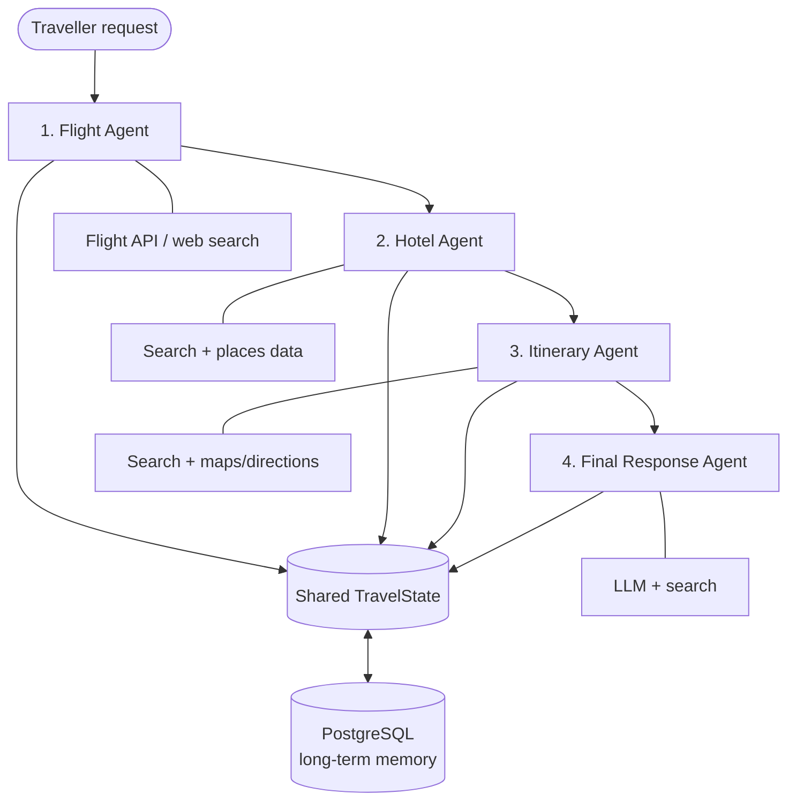

# TripPilot AI ✈️

**TripPilot AI** is a multi-agent travel-planning assistant that turns a simple travel request into a practical, personalized trip plan. Instead of asking one AI model to do everything, TripPilot delegates work to specialist agents for flights, hotels, daily itineraries, and a final, easy-to-read travel brief.

> _“Plan a 5-day budget-friendly trip to Jaipur from Delhi in October for two people.”_

TripPilot can research the best options, organize them into a day-by-day plan, and return one complete response with choices, prices, travel tips, and next steps.

## Why TripPilot?

Planning a trip usually means jumping between flight websites, hotel listings, maps, blogs, and notes. TripPilot brings those steps into one conversational experience while keeping each task focused and reliable.

- **Specialist agents** handle distinct travel decisions.
- **Shared trip state** keeps every agent working from the same trip context.
- **Persistent memory** remembers conversations and user preferences.
- **Structured final answers** make plans actionable, not overwhelming.

## How it works



### Agent workflow

| Agent | Responsibility | Typical output |
| --- | --- | --- |
| **Flight Agent** | Finds and compares flight options based on origin, destination, dates, travellers, budget, and preferences. | Recommended flights, prices, timings, stops, booking links. |
| **Hotel Agent** | Searches for suitable stays and compares location, price, rating, amenities, and proximity to key areas. | Shortlisted hotels with pros, cons, and nightly/total estimates. |
| **Itinerary Agent** | Builds a realistic day-by-day route using attractions, activities, opening hours, travel time, and the traveller’s style. | Daily schedule, nearby places, meal/activity suggestions, and transport guidance. |
| **Final Response Agent** | Combines all agent outputs into one helpful answer, resolves gaps, and presents the plan clearly. | Complete trip summary, budget breakdown, recommendations, and travel notes. |

## Shared state and memory

All agents read from and write to a single `TravelState`. This avoids repeated questions and makes it possible for the final agent to combine decisions made earlier in the workflow.

```ts
type TravelState = {
  userQuery: string;
  trip: {
    origin?: string;
    destination?: string;
    startDate?: string;
    endDate?: string;
    travellers?: number;
    budget?: string;
    preferences?: string[];
  };
  flightResults?: FlightOption[];
  hotelResults?: HotelOption[];
  itinerary?: DayPlan[];
  finalResponse?: string;
  messages: ChatMessage[];
};
```

PostgreSQL is used for durable storage of:

- Conversation history
- Traveller preferences (budget, hotel style, pace, interests, dietary needs, etc.)
- Agent results and state updates
- Saved and previously generated trip plans

## Recommended tools and integrations

| Need | Suggested integration | Notes |
| --- | --- | --- |
| Flight search | AviationStack, Amadeus, or another flight provider | Use a provider that supports the regions and pricing data you need. |
| Hotel discovery | Tavily Search and/or Google Places API | Places data is useful for ratings, amenities, and location context. |
| Attractions and routing | Tavily Search, Google Maps Places API, Google Directions API | Helps create geographically sensible daily plans. |
| AI reasoning and final writing | Groq (for example, Llama models) or another LLM provider | Keep model prompts focused on each agent’s task. |
| Long-term memory | PostgreSQL | Store structured trip state alongside messages. |

> API results can change quickly. Display the provider, search time, currency, and a booking/deep link whenever possible; do not present live availability or prices as guaranteed.

## Example request

```text
Plan a 4-day trip from Bengaluru to Goa for two people in December.
Our total budget is ₹45,000. We prefer a clean beach-side hotel,
local seafood, relaxed beaches, and one adventurous activity.
```

## Example final response structure

```text
Trip overview
- Bengaluru → Goa | 4 days | 2 travellers | ₹45,000 budget

Best flight option
- Airline, departure/arrival, duration, stops, price, booking link

Recommended stay
- Hotel, neighbourhood, rating, amenities, nightly price, total price

Day-by-day itinerary
- Day 1: Arrival, check-in, nearby beach and dinner
- Day 2: North Goa sights and water activity
- Day 3: South Goa / culture / relaxed evening
- Day 4: Breakfast, checkout, return flight

Estimated budget
- Flights, stay, local transport, activities, food, buffer

Helpful notes
- Best booking timing, weather/packing guidance, and assumptions
```

## Project goals

- Create personalised, end-to-end trip plans from natural-language requests.
- Recommend options that balance budget, convenience, quality, and traveller preferences.
- Produce realistic itineraries that account for distance and time—not just a list of attractions.
- Preserve context across conversations so repeat users do not need to restate their preferences.
- Keep outputs transparent by separating live search results, assumptions, and recommendations.

## Suggested technical architecture

```text
Frontend (web or mobile chat interface)
        │
        ▼
API / Orchestrator
        │
        ├── Flight Agent ─────► flight-search provider
        ├── Hotel Agent ──────► search / places provider
        ├── Itinerary Agent ──► search / maps provider
        └── Final Response Agent ─► LLM
        │
        ▼
Shared TravelState + PostgreSQL
```

The orchestrator should validate the request, decide which agents are needed, pass the relevant state to each one, capture tool failures gracefully, and ask a concise follow-up question only when critical trip details are missing.

## Development plan

1. **Define the data model** — create `TravelState`, agent input/output schemas, and database tables.
2. **Build the orchestration layer** — route a request through agents and persist each state update.
3. **Integrate travel tools** — add flight, places, search, and directions providers behind small adapter modules.
4. **Create agent prompts** — give each agent a clear role, constraints, and structured output format.
5. **Build the chat experience** — show progress, options, assumptions, and the final trip plan.
6. **Test with real scenarios** — single-city trips, multi-city trips, low budgets, families, accessibility needs, and unavailable results.

## Reliability and privacy principles

- Validate dates, locations, traveller counts, and currency before searching.
- Treat external results as time-sensitive; show the source and retrieval time where possible.
- Do not invent prices, availability, reviews, opening hours, or booking links.
- Provide fallback recommendations when an API is unavailable.
- Store only the data needed to provide the service, and protect user conversations and preferences.
- Clearly label estimates and assumptions in the final answer.

## Roadmap

- [ ] Flight, hotel, and itinerary agent implementations
- [ ] PostgreSQL-backed conversation memory
- [ ] Live search and maps integrations
- [ ] Budget calculator and currency support
- [ ] Saved trips and itinerary export (PDF/calendar)
- [ ] User preference profiles
- [ ] Multi-city planning
- [ ] Booking-provider deep links
- [ ] Evaluation suite for recommendation quality and itinerary feasibility

## Contributing

Contributions are welcome. When adding an agent or provider, keep its interface small, return structured data, document required environment variables, and add tests for both successful and failed tool calls.

## License

Add a license before publishing this project (for example, MIT or Apache-2.0).
